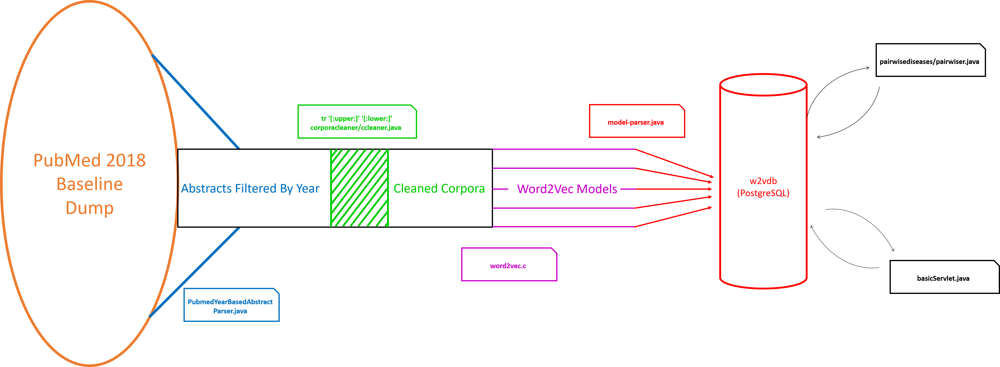

# Word2vec Temporal Medical Data Analysis
## Using word2vec to analyze large medical corpora
#### to run server go to -> https://spotlite.nih.gov/nick.kibbey/pubmedW2VserverStuff.git
### Introduction:  TL;DR- Analyze medical data to identify converging research
The goal of this project is to track how relevant research terms have been used over time. 
Word2Vec (w2v) is a popular shallow neural net that uses (in this project) a continuous bag of words (cbow) to turn words into vectors. 
Vectors can be compared relationally and answer analogies like "man is to woman as king is to __?"
There are numerous studies/papers that analyze and quantify w2v. 
The project attempts to advance the utility of this technology through temporal analysis.
By limiting input text to abstracts stored by PubMed the output models become relevant and applicable to researchers.
---- This project gives the tools to parse pubmed but for obvious reasons we can't store 5 gbs of zipped text files attained from 250+gb data dump.
If you don't have the parsed corpora you're in for a treat :). ----
This data is filtered by year to display change over time.
This analysis shows the potential in identifying converging research topics prior to the discovery of an explicit link.

# Our pipeline 



### Current Methods: w2v and some validation
w2v in this project has been used on default settings 
#### see <a href="https://spotlite.nih.gov/nick.kibbey/word2vec/blob/master/w2vTricks.txt"> w2vTricks.txt</a> for more details.

If you want a repeatable way to reduce dimensions from your models lookup pca. If you want better clustering but needs more optimization, luck, and skepticism use t-SNE. TensorFlow has good stuff for this, I was using it but then instead of reinventing the wheel I decided to just go the direction of temporal analysis rather than an interactive map.

validation was done by going onto disease-ontology.org and manually seeing the last common ancestor in the branch hierarchy between the two dieseases, you can use your own method just establish a ground truth about units of measurement because abstracts are going to suck about telling you info like argentina:buenos_aires:: peru:? because scientists aren't talking about their holiday trip to machu pichu when they have to publish where as google news most certainly does.

naive approach was take a term, find all the words that appear in an abstract with that word and keep the counts of these associated words. If an associated word has a count that puts it in the top 50% of that term's associated words then we call it a frequent word. Similarity between terms a,b is computed by the intersection of frequent words for a,b divided by the union.

analysis was done through pairwise comparison of unique non-trivial values between test matricies and base matrix; spearman's rank correlation coefficient and 2-tailed distribution for p-value. 

message me if you want the validation stuffs I did mine on 20 diseases pairwise compared to make a whole lot of number crunching but heat maps are pretty and 1.3 x 10^-19 makes for a convincing p-value.
The naive implementation is also available at https://github.com/nkibbey/w2v/tree/master/StupidW2V 

## Requirements
### If you want the useful stuff that's more on the "final draft" of my project
Be able to run c code w/gcc; make file provided in w2v

Java >= 1.8 (I use lambdas)

install maven and postgres, here are some things that might be nice...

`apt-get install maven postgresql postgresql-contrib`

### If you want to do all the stuff I was doing with python, it's good to have this stuff
Currently Python2.7

`apt-get install maven python-pip python-dev python-virtualenv`

``` pip install numpy scipy gensim scikit-learn flask flask-restful   ```

`pip install -U tensorflow`

## Example things you can do
Get some interesting info that is in the print info method of pairwiser.java from a w2vdb postgres db...
```
cd parse/pairwisediseases/
mvn clean package
java -jar /target/<target-with-dependencies>
```

### Notes: Finished project will maybe be on a docker image to reduce env config time
Helpful config libraries because I currently don't have a docker profile. 

I also provided setup in virtualenv but it's a bit overkill.

